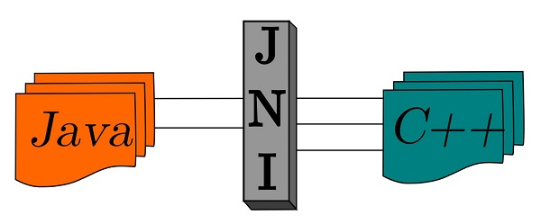
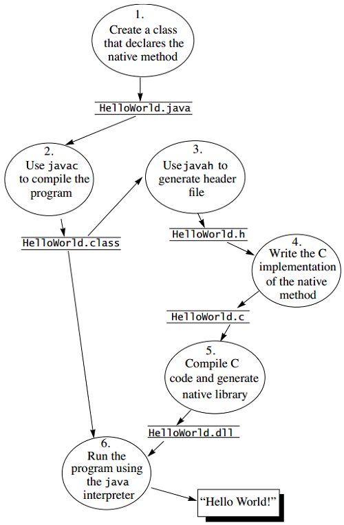
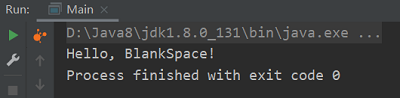

# Java-JNI-Demo

JNI 是 Java Native Interface 的缩写，通过使用 Java 本地接口书写程序，可以确保代码在不同的平台上方便移植。

从 Java 1.1 开始，JNI 标准成为 Java 平台的一部分，它允许 Java 代码和其他语言写的代码进行交互。

提供 JNI 一开始是为了本地已编译语言，尤其是 C 和 C++ 而设计的，但是它并不妨碍使用其他编程语言，只要调用约定受支持就可以了。

使用 Java 与本地已编译的代码交互，通常会丧失平台可移植性。 
但是，有些情况下这样做是可以接受的，甚至是必须的。 
例如，使用一些旧的库，与硬件、操作系统进行交互，或者为了提高程序的性能。

JNI 标准至少要保证本地代码能工作在任何 Java 虚拟机环境。

## 操作流程

[这篇文章](https://www.cnblogs.com/strongmore/p/14679019.html) 为完成该流程提供了全程指导，可以参考。

运行结果： 

