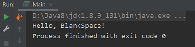

# Java-JNI-Demo

对`HelloJNI`输入以下命令生成`hellojni.h`用于生成`.dll`：
- Java 11 以下：`javah -jni -o hellojni.h HelloJNI`
- Java 11 以上：`javac -h . HelloJNI.java`

对获得的`libhellojni.dll`，可以使用`System.load`调用绝对路径对应的`.dll`，或者使用`System.loadLibrary`调用环境变量可检索的`.dll`。

